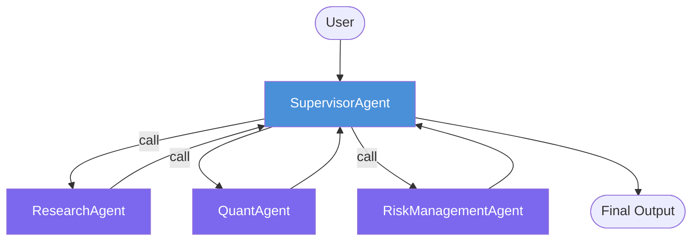
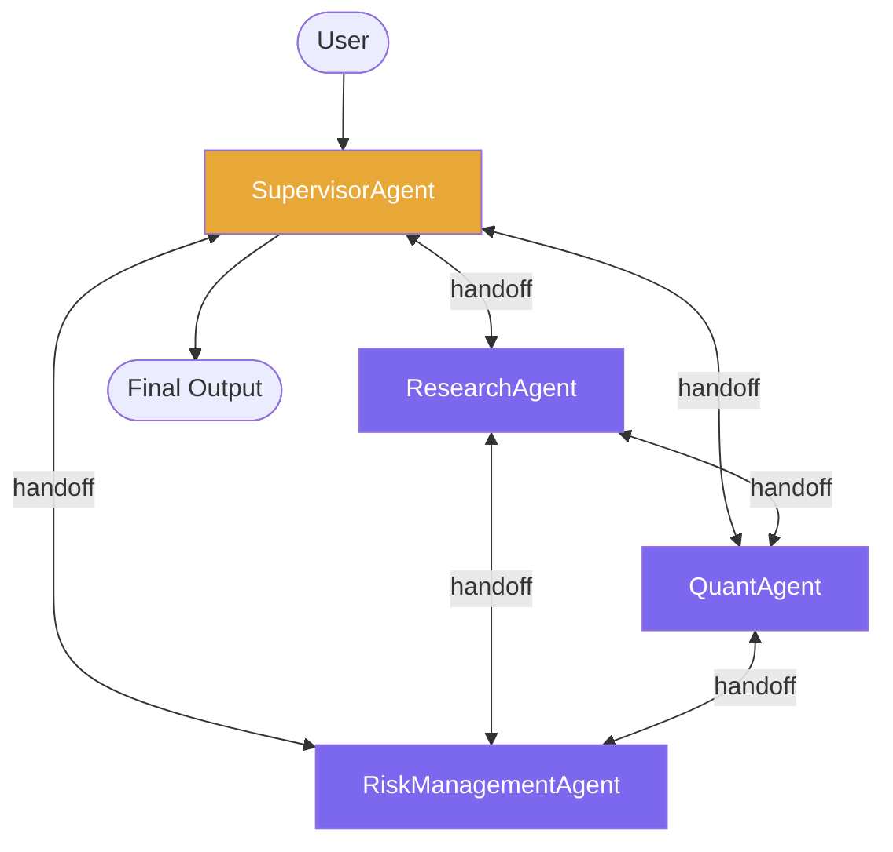
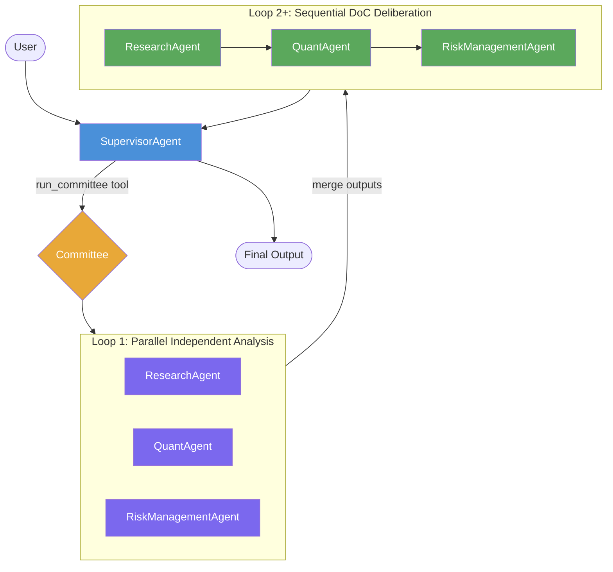
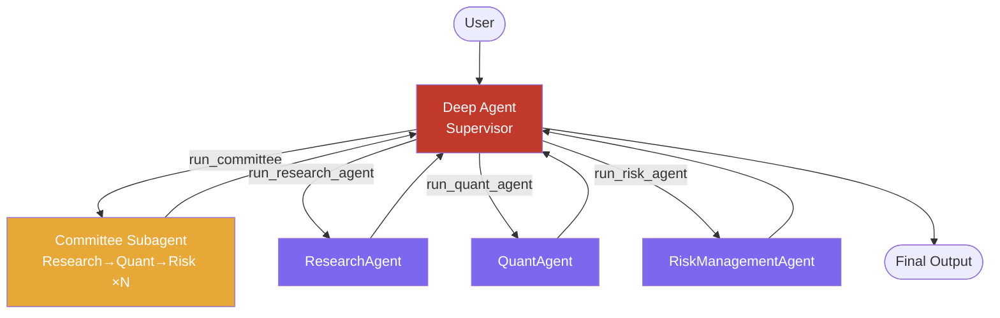

# Z-App

Multi-agent financial analysis system built on **LangGraph**. Three specialist agents (Research, Quant, Risk Management) collaborate under different coordination architectures, switchable via `architecture_type` in `app.py`.

---

## Agents

| Agent | Role |
|-------|------|
| **SupervisorAgent** | Orchestrates the workflow, synthesizes final output |
| **ResearchAgent** | Market research, thesis generation, fundamental analysis (has Google Search) |
| **QuantAgent** | Quantitative modeling, factor/alpha models, backtesting |
| **RiskManagementAgent** | Drawdown analysis, scenario analysis, position sizing, hedging |

---

## Architecture Modes

### 1. `supervisor_only` / `supervisor_framework`

Supervisor uses **`langgraph-supervisor`** to dispatch tasks to member agents. All control flows through the Supervisor — agents never communicate with each other directly.



**Characteristics:**
- Supervisor decides which agent to call and when
- Agents are isolated — no peer-to-peer communication
- Predictable, easy to trace
- Library: `langgraph-supervisor`

---

### 2. `supervisor_swarm`

All agents are connected via **handoff tools** (`langgraph-swarm`). Supervisor is the default entry point, but any agent can transfer control directly to any other agent without returning to Supervisor first.



**Characteristics:**
- Any agent can hand off control to any other agent
- Supervisor acts as entry/exit, not a bottleneck
- More flexible but control flow is less predictable
- Library: `langgraph-swarm` + `create_handoff_tool`

---

### 3. `set_workflow` *(current active)*

Supervisor calls a `run_committee` tool that runs a structured **Investment Committee** workflow. The committee has two phases:

- **Loop 1 — Parallel:** All three agents analyze independently at the same time (~3x faster)
- **Loop 2+ — Sequential DoC:** Agents read each other's outputs and deliberate in order (Disagree-or-Commit)



**Characteristics:**
- Supervisor is a `create_supervisor` with `run_committee` as a tool
- Loop 1 uses `ThreadPoolExecutor` (3 workers) for parallel execution
- Loop 2+ uses the sequential committee subgraph for deliberation
- Default: `loops=2` (1 parallel + 1 sequential DoC round)
- Library: `langgraph`, `langgraph-supervisor`

---

### 4. `forced_debate` *(experimental, commented out)*

A **Deep Agent** (`deepagents`) orchestrates the committee as a subagent tool. Similar to `set_workflow` but uses a deeper agent architecture that can plan multi-step strategies before invoking the committee.



**Characteristics:**
- Supervisor can call the full committee OR individual agents as separate tools
- Gives the orchestrator more fine-grained control
- Library: `deepagents`

---

## Architecture Comparison

| Mode | Control Flow | Agent-to-Agent | Parallelism | Library |
|------|-------------|---------------|-------------|---------|
| `supervisor_only` | Supervisor → Agent → Supervisor | No | No | `langgraph-supervisor` |
| `supervisor_framework` | Supervisor → Agent → Supervisor | No | No | `langgraph-supervisor` |
| `supervisor_swarm` | Any → Any via handoff | Yes | No | `langgraph-swarm` |
| `set_workflow` ✅ | Supervisor → Committee tool | Via committee | Yes (Loop 1) | `langgraph`, `langgraph-supervisor` |
| `forced_debate` | Deep Agent → tools | Via committee | No | `deepagents` |

---

## Configuration (`app.py`)

```python
# Switch architecture
architecture_type = "set_workflow"  # "supervisor_only" | "supervisor_framework" | "supervisor_swarm" | "set_workflow"

# Switch model provider
model_set = "gemini"   # "gemini" | "openai" | "anthropic"

# Use OpenRouter for model routing
use_open_router = True
```

### Supported Models

| Provider | Model |
|----------|-------|
| Gemini | `google/gemini-3-flash-preview` |
| OpenAI | `openai/gpt-5.2` |
| Anthropic | `anthropic/claude-sonnet-4.6` |
